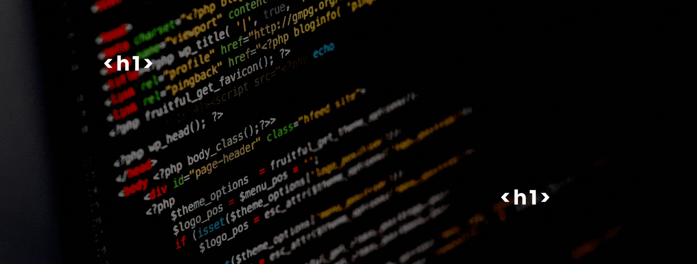

<h2 align="center">
Hola! soy Bruno Bohlmann y soy Full Stack Developer
<h2>

___

	¡Me presento! 😄
	Soy Bruno y tengo 19 años. Soy de Argentina y estoy dando mis primeros pasos en el mundo IT. 🤓
	Me defino como un apasionado... apasionado por la tecnología, la música y el espacio, y quiero dejar mi huella en esto algun dia 🚀

<h3>Pero bueno... por algun lado hay q empezar</h3>
	
<h2>¿Qué es lo que hago?<h2>

	◼ Soy Desarrollador Full Stack y cuento con una experiencia corta pero firme gracias a los proyectos que he realizado (PokemonApi) (E-commerce) en el bootcamp soy Henry. 
	◼ En este trayecto he aprendido lo necesario para ser un Full Stack. #JavaScript #React #Redux #CSS #HTML #Sequelize #Node #Express #PostgreSQL #Git
	◼ Ademas he aprendido por mi cuenta #MongoDB #TailwindCss #MaterialUI y en proceso de aprendizaje de Next.js

<h2>Si queres contactarme<h2>

- https://www.linkedin.com/in/bruno-bohlmann/
- https://wa.link/iz686v
